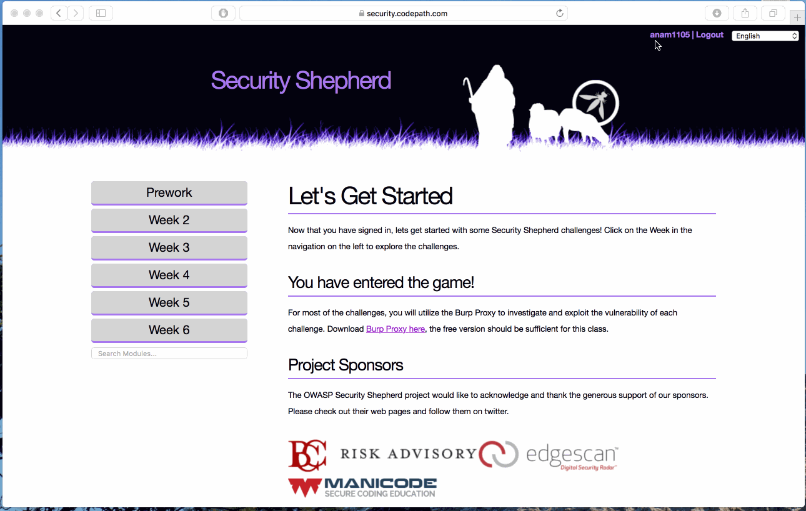

# Cybersecurity Week 4 - *anam1105* 

## Description

This is my (Ana Malhotra's) submission of the Cybersecurity Week 4 Lab.

It includes:
* Completed functionality information
* Video walkthrough, featuring:
  * Username on Security Shepard
  * Completed challenges on Security Shepard
* Notes on challenges encountered
* Installation Instructions
* License information

Time spent: **2** hours spent in total 

## User Stories

The following **required** functionality is completed:

1. [x]  Required: Challenge 0 - Broken Session Management
2. [x]  Required: Challenge 1 - Session Management Challenge 1
3. [x]  Required: Challenge 2 - Session Management Challenge 2
4. [x]  Required: Challenge 3 - Session Management Challenge 3
5. [x]  Required: Challenge 4 - Cross Site Request Forgery
6. [x]  Required: Challenge 5 - CSRF 1

The following advanced user stories are optional:

* [ ]  Bonus 1: CSRF 2 

## Video Walkthrough

Here's a walkthrough of implemented user stories:

GIF created with [LiceCap](http://www.cockos.com/licecap/).

## Notes

This lab was a lot of fun! Challenge 5 was probably the most difficult because it required action from other users, but we weren't sure what that action was exactly.

## Installation Instructions

Setup instructions can be found on the Week 4 Lab page.

It should be noted that any browser can be used; however, Chrome and Firefox have one the most user-friendly Inspect Element interfaces.

## License

    Copyright [2017] [Ana Malhotra]

    Licensed under the Apache License, Version 2.0 (the "License");
    you may not use this file except in compliance with the License.
    You may obtain a copy of the License at

        http://www.apache.org/licenses/LICENSE-2.0

    Unless required by applicable law or agreed to in writing, software
    distributed under the License is distributed on an "AS IS" BASIS,
    WITHOUT WARRANTIES OR CONDITIONS OF ANY KIND, either express or implied.
    See the License for the specific language governing permissions and
    limitations under the License.